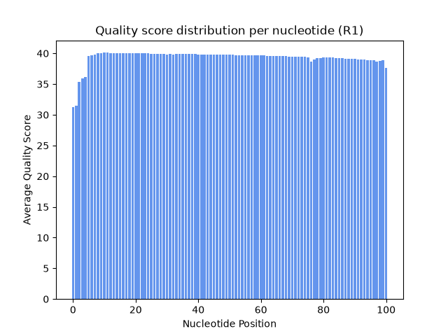
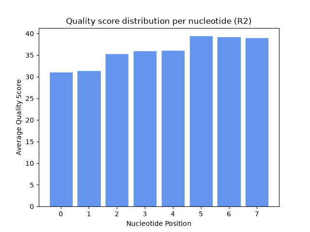
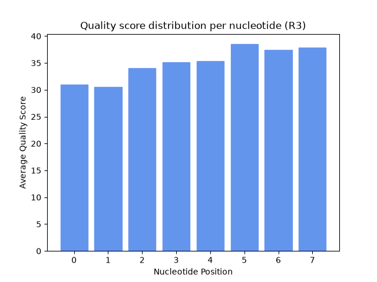
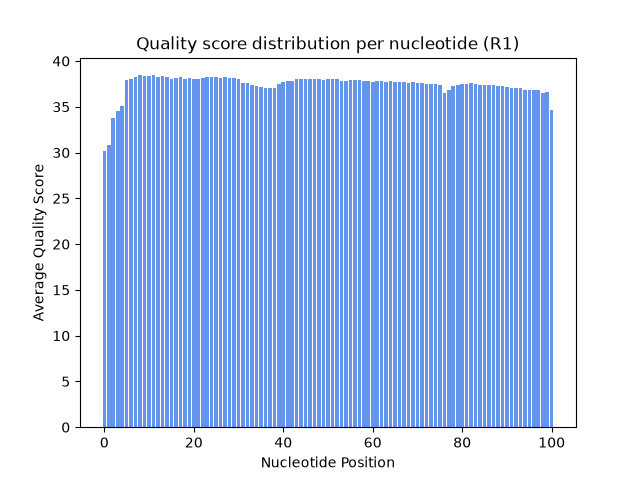

# Assignment the First

## Part 1
1. Be sure to upload your Python script. Provide a link to it here:

    [Quality Score Script](qscores.py)

| File name | label | Read length | Phred encoding |
|---|---|---|---|
| 1294_S1_L008_R1_001.fastq.gz | Read 1 | 101 | 33 |
| 1294_S1_L008_R2_001.fastq.gz | Index 1  | 8 | 33 |
| 1294_S1_L008_R3_001.fastq.gz | Index 2 | 8 | 33 |
| 1294_S1_L008_R4_001.fastq.gz | Read 2 | 101 | 33 |

2. Per-base NT distribution
    1. 
       
       
       
    2. An appropriate quality score cutoff level for these biological read pair data would be `35`, as the majority of reads fall above this score (meaning we still get sufficient data) while trimming the lowest quality reads. Illumina documentation states that a Qscore of 30 has an error probabilty of 1 in 1,000, and 40 has probability of 1 in 10,000. Since it is a log scale, 35 has an approximate error probability of 1 in 3,000. 

        For the index reads, we can likely be a little more generous and lower the cutoff, since we need to include as many barcodes as possible, given they are our identifiers. Additionally, one call being incorrect out of eight is unlikely to chaange the index read to another index, as they hopefully differ by more than one nucleotide. For this reason, I'd choose a cutoff of `30`. 

    3. Per the command listed below, R2 (index 1) has `3,976,613` reads with Ns (of 363,246,735 total reads = 1.09%), while R3 (index 2) has `3,328,051` (0.92%). 

        `zcat 1294_S1_L008_R2_001.fastq.gz | grep -B 1 "^+" | grep -v "^--" | grep -v "^+" | grep "N" | wc -l`
## Part 2
1. Define the problem
    We have four separate files, a read file and index file for read one, and a read file and index file for read two. We need to assess whether the indices match, have hopped, or are not in our list of known indices. We also aim to separate the data into individual files, separated by index. 

2. Describe output
    This code will output 52 files. 48 files containing matched reads (24 from read 1, 24 from read 2), 2 files listing which reads demonstrated index hopping (1 for read 1 one for read 2), and 2 files listing which reads were unable to be matched to an index (read 1 and read 2).

    Additionally, the code will calculate a few statistics on the data, including how many read-pairs had properly matched indices for each potential index pair, how many read-pairs exhibited index hopping, and how many had unknown indices. 

3. Upload your [4 input FASTQ files](../TEST-input_FASTQ) and your [>=6 expected output FASTQ files](../TEST-output_FASTQ).

    Using the barcodes CTTA and TGAC, my four test files will result in:
        two records in the 1:1 matching index file (CTTA-TAAG)
        one record in the 2:2 matching index file (TGAC-GTCA)
        one hopped read in the 1:2 index file (CTTA-GTCA)
        and one read in unknown. (NTTA-NAAG)

4. Pseudocode

    [pseudocode.txt](pseudocode.txt)

5. High level functions. For each function, be sure to include:
        **(See pseudocode)**

    1. Description/doc string
    2. Function headers (name and parameters)
    3. Test examples for individual functions
    4. Return statement
