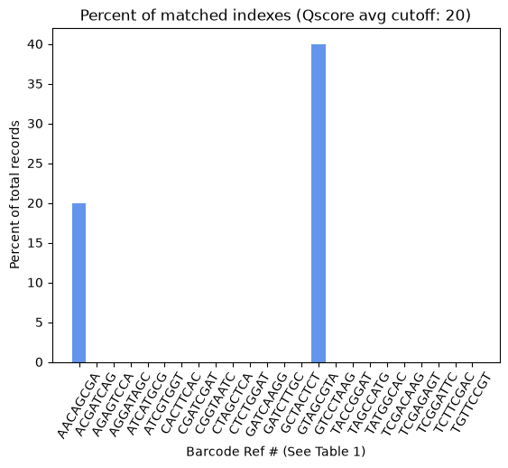

## Basic Stats:
Total number of records: 5

Total number of matched reads: 3 (60.00%)

Total number of hopped reads: 1 (20.00%)

Total number of unknown reads: 1 (20.00%)

## Matched Indexes:

### Table 1: 
| Ref # | Index | Count | Percent |
|----------|----------|----------|----------|
| 1 | AACAGCGA | 1 | 20.00% |
| 2 | ACGATCAG | 0 | 0.00% |
| 3 | AGAGTCCA | 0 | 0.00% |
| 4 | AGGATAGC | 0 | 0.00% |
| 5 | ATCATGCG | 0 | 0.00% |
| 6 | ATCGTGGT | 0 | 0.00% |
| 7 | CACTTCAC | 0 | 0.00% |
| 8 | CGATCGAT | 0 | 0.00% |
| 9 | CGGTAATC | 0 | 0.00% |
| 10 | CTAGCTCA | 0 | 0.00% |
| 11 | CTCTGGAT | 0 | 0.00% |
| 12 | GATCAAGG | 0 | 0.00% |
| 13 | GATCTTGC | 0 | 0.00% |
| 14 | GCTACTCT | 0 | 0.00% |
| 15 | GTAGCGTA | 2 | 40.00% |
| 16 | GTCCTAAG | 0 | 0.00% |
| 17 | TACCGGAT | 0 | 0.00% |
| 18 | TAGCCATG | 0 | 0.00% |
| 19 | TATGGCAC | 0 | 0.00% |
| 20 | TCGACAAG | 0 | 0.00% |
| 21 | TCGAGAGT | 0 | 0.00% |
| 22 | TCGGATTC | 0 | 0.00% |
| 23 | TCTTCGAC | 0 | 0.00% |
| 24 | TGTTCCGT | 0 | 0.00% |

## Hopped Indexes:
### Table 2: 
| Ref # | Index 1 | Index 2 | Count | Percent |
|----------|----------|----------|----------|----------|
| 25 | AACAGCGA | ACGATCAG | 0 | 0.00% |
| 26 | AACAGCGA | AGAGTCCA | 0 | 0.00% |
| 27 | AACAGCGA | AGGATAGC | 0 | 0.00% |
| 28 | AACAGCGA | ATCATGCG | 0 | 0.00% |
| 29 | AACAGCGA | ATCGTGGT | 0 | 0.00% |
| 30 | AACAGCGA | CACTTCAC | 0 | 0.00% |
| 31 | AACAGCGA | CGATCGAT | 0 | 0.00% |
| 32 | AACAGCGA | CGGTAATC | 0 | 0.00% |
| 33 | AACAGCGA | CTAGCTCA | 0 | 0.00% |
| 34 | AACAGCGA | CTCTGGAT | 0 | 0.00% |
| 35 | AACAGCGA | GATCAAGG | 0 | 0.00% |
| 36 | AACAGCGA | GATCTTGC | 0 | 0.00% |
| 37 | AACAGCGA | GCTACTCT | 0 | 0.00% |
| 38 | AACAGCGA | GTAGCGTA | 0 | 0.00% |
| 39 | AACAGCGA | GTCCTAAG | 0 | 0.00% |
| 40 | AACAGCGA | TACCGGAT | 0 | 0.00% |
| 41 | AACAGCGA | TAGCCATG | 0 | 0.00% |
| 42 | AACAGCGA | TATGGCAC | 0 | 0.00% |
| 43 | AACAGCGA | TCGACAAG | 0 | 0.00% |
| 44 | AACAGCGA | TCGAGAGT | 0 | 0.00% |
| 45 | AACAGCGA | TCGGATTC | 0 | 0.00% |
| 46 | AACAGCGA | TCTTCGAC | 0 | 0.00% |
| 47 | AACAGCGA | TGTTCCGT | 0 | 0.00% |
| 48 | ACGATCAG | AACAGCGA | 0 | 0.00% |
| 49 | ACGATCAG | AGAGTCCA | 0 | 0.00% |
| 50 | ACGATCAG | AGGATAGC | 0 | 0.00% |
| 51 | ACGATCAG | ATCATGCG | 0 | 0.00% |
| 52 | ACGATCAG | ATCGTGGT | 0 | 0.00% |
| 53 | ACGATCAG | CACTTCAC | 0 | 0.00% |
| 54 | ACGATCAG | CGATCGAT | 0 | 0.00% |
| 55 | ACGATCAG | CGGTAATC | 0 | 0.00% |
| 56 | ACGATCAG | CTAGCTCA | 0 | 0.00% |
| 57 | ACGATCAG | CTCTGGAT | 0 | 0.00% |
| 58 | ACGATCAG | GATCAAGG | 0 | 0.00% |
| 59 | ACGATCAG | GATCTTGC | 0 | 0.00% |
| 60 | ACGATCAG | GCTACTCT | 0 | 0.00% |
| 61 | ACGATCAG | GTAGCGTA | 0 | 0.00% |
| 62 | ACGATCAG | GTCCTAAG | 0 | 0.00% |
| 63 | ACGATCAG | TACCGGAT | 0 | 0.00% |
| 64 | ACGATCAG | TAGCCATG | 0 | 0.00% |
| 65 | ACGATCAG | TATGGCAC | 0 | 0.00% |
| 66 | ACGATCAG | TCGACAAG | 0 | 0.00% |
| 67 | ACGATCAG | TCGAGAGT | 0 | 0.00% |
| 68 | ACGATCAG | TCGGATTC | 0 | 0.00% |
| 69 | ACGATCAG | TCTTCGAC | 0 | 0.00% |
| 70 | ACGATCAG | TGTTCCGT | 0 | 0.00% |
| 71 | AGAGTCCA | AACAGCGA | 0 | 0.00% |
| 72 | AGAGTCCA | ACGATCAG | 0 | 0.00% |
| 73 | AGAGTCCA | AGGATAGC | 0 | 0.00% |
| 74 | AGAGTCCA | ATCATGCG | 0 | 0.00% |
| 75 | AGAGTCCA | ATCGTGGT | 0 | 0.00% |
| 76 | AGAGTCCA | CACTTCAC | 0 | 0.00% |
| 77 | AGAGTCCA | CGATCGAT | 0 | 0.00% |
| 78 | AGAGTCCA | CGGTAATC | 0 | 0.00% |
| 79 | AGAGTCCA | CTAGCTCA | 0 | 0.00% |
| 80 | AGAGTCCA | CTCTGGAT | 0 | 0.00% |
| 81 | AGAGTCCA | GATCAAGG | 0 | 0.00% |
| 82 | AGAGTCCA | GATCTTGC | 0 | 0.00% |
| 83 | AGAGTCCA | GCTACTCT | 0 | 0.00% |
| 84 | AGAGTCCA | GTAGCGTA | 0 | 0.00% |
| 85 | AGAGTCCA | GTCCTAAG | 0 | 0.00% |
| 86 | AGAGTCCA | TACCGGAT | 0 | 0.00% |
| 87 | AGAGTCCA | TAGCCATG | 0 | 0.00% |
| 88 | AGAGTCCA | TATGGCAC | 0 | 0.00% |
| 89 | AGAGTCCA | TCGACAAG | 0 | 0.00% |
| 90 | AGAGTCCA | TCGAGAGT | 0 | 0.00% |
| 91 | AGAGTCCA | TCGGATTC | 0 | 0.00% |
| 92 | AGAGTCCA | TCTTCGAC | 0 | 0.00% |
| 93 | AGAGTCCA | TGTTCCGT | 0 | 0.00% |
| 94 | AGGATAGC | AACAGCGA | 0 | 0.00% |
| 95 | AGGATAGC | ACGATCAG | 0 | 0.00% |
| 96 | AGGATAGC | AGAGTCCA | 0 | 0.00% |
| 97 | AGGATAGC | ATCATGCG | 0 | 0.00% |
| 98 | AGGATAGC | ATCGTGGT | 0 | 0.00% |
| 99 | AGGATAGC | CACTTCAC | 0 | 0.00% |
| 100 | AGGATAGC | CGATCGAT | 0 | 0.00% |
| 101 | AGGATAGC | CGGTAATC | 0 | 0.00% |
| 102 | AGGATAGC | CTAGCTCA | 0 | 0.00% |
| 103 | AGGATAGC | CTCTGGAT | 0 | 0.00% |
| 104 | AGGATAGC | GATCAAGG | 0 | 0.00% |
| 105 | AGGATAGC | GATCTTGC | 0 | 0.00% |
| 106 | AGGATAGC | GCTACTCT | 0 | 0.00% |
| 107 | AGGATAGC | GTAGCGTA | 0 | 0.00% |
| 108 | AGGATAGC | GTCCTAAG | 0 | 0.00% |
| 109 | AGGATAGC | TACCGGAT | 0 | 0.00% |
| 110 | AGGATAGC | TAGCCATG | 0 | 0.00% |
| 111 | AGGATAGC | TATGGCAC | 0 | 0.00% |
| 112 | AGGATAGC | TCGACAAG | 0 | 0.00% |
| 113 | AGGATAGC | TCGAGAGT | 0 | 0.00% |
| 114 | AGGATAGC | TCGGATTC | 0 | 0.00% |
| 115 | AGGATAGC | TCTTCGAC | 0 | 0.00% |
| 116 | AGGATAGC | TGTTCCGT | 0 | 0.00% |
| 117 | ATCATGCG | AACAGCGA | 0 | 0.00% |
| 118 | ATCATGCG | ACGATCAG | 0 | 0.00% |
| 119 | ATCATGCG | AGAGTCCA | 0 | 0.00% |
| 120 | ATCATGCG | AGGATAGC | 0 | 0.00% |
| 121 | ATCATGCG | ATCGTGGT | 0 | 0.00% |
| 122 | ATCATGCG | CACTTCAC | 0 | 0.00% |
| 123 | ATCATGCG | CGATCGAT | 0 | 0.00% |
| 124 | ATCATGCG | CGGTAATC | 0 | 0.00% |
| 125 | ATCATGCG | CTAGCTCA | 0 | 0.00% |
| 126 | ATCATGCG | CTCTGGAT | 0 | 0.00% |
| 127 | ATCATGCG | GATCAAGG | 0 | 0.00% |
| 128 | ATCATGCG | GATCTTGC | 0 | 0.00% |
| 129 | ATCATGCG | GCTACTCT | 0 | 0.00% |
| 130 | ATCATGCG | GTAGCGTA | 0 | 0.00% |
| 131 | ATCATGCG | GTCCTAAG | 0 | 0.00% |
| 132 | ATCATGCG | TACCGGAT | 0 | 0.00% |
| 133 | ATCATGCG | TAGCCATG | 0 | 0.00% |
| 134 | ATCATGCG | TATGGCAC | 0 | 0.00% |
| 135 | ATCATGCG | TCGACAAG | 0 | 0.00% |
| 136 | ATCATGCG | TCGAGAGT | 0 | 0.00% |
| 137 | ATCATGCG | TCGGATTC | 0 | 0.00% |
| 138 | ATCATGCG | TCTTCGAC | 0 | 0.00% |
| 139 | ATCATGCG | TGTTCCGT | 0 | 0.00% |
| 140 | ATCGTGGT | AACAGCGA | 0 | 0.00% |
| 141 | ATCGTGGT | ACGATCAG | 0 | 0.00% |
| 142 | ATCGTGGT | AGAGTCCA | 0 | 0.00% |
| 143 | ATCGTGGT | AGGATAGC | 0 | 0.00% |
| 144 | ATCGTGGT | ATCATGCG | 0 | 0.00% |
| 145 | ATCGTGGT | CACTTCAC | 0 | 0.00% |
| 146 | ATCGTGGT | CGATCGAT | 0 | 0.00% |
| 147 | ATCGTGGT | CGGTAATC | 0 | 0.00% |
| 148 | ATCGTGGT | CTAGCTCA | 0 | 0.00% |
| 149 | ATCGTGGT | CTCTGGAT | 0 | 0.00% |
| 150 | ATCGTGGT | GATCAAGG | 0 | 0.00% |
| 151 | ATCGTGGT | GATCTTGC | 0 | 0.00% |
| 152 | ATCGTGGT | GCTACTCT | 0 | 0.00% |
| 153 | ATCGTGGT | GTAGCGTA | 0 | 0.00% |
| 154 | ATCGTGGT | GTCCTAAG | 0 | 0.00% |
| 155 | ATCGTGGT | TACCGGAT | 0 | 0.00% |
| 156 | ATCGTGGT | TAGCCATG | 0 | 0.00% |
| 157 | ATCGTGGT | TATGGCAC | 0 | 0.00% |
| 158 | ATCGTGGT | TCGACAAG | 0 | 0.00% |
| 159 | ATCGTGGT | TCGAGAGT | 0 | 0.00% |
| 160 | ATCGTGGT | TCGGATTC | 0 | 0.00% |
| 161 | ATCGTGGT | TCTTCGAC | 0 | 0.00% |
| 162 | ATCGTGGT | TGTTCCGT | 0 | 0.00% |
| 163 | CACTTCAC | AACAGCGA | 0 | 0.00% |
| 164 | CACTTCAC | ACGATCAG | 0 | 0.00% |
| 165 | CACTTCAC | AGAGTCCA | 0 | 0.00% |
| 166 | CACTTCAC | AGGATAGC | 0 | 0.00% |
| 167 | CACTTCAC | ATCATGCG | 0 | 0.00% |
| 168 | CACTTCAC | ATCGTGGT | 0 | 0.00% |
| 169 | CACTTCAC | CGATCGAT | 0 | 0.00% |
| 170 | CACTTCAC | CGGTAATC | 0 | 0.00% |
| 171 | CACTTCAC | CTAGCTCA | 0 | 0.00% |
| 172 | CACTTCAC | CTCTGGAT | 0 | 0.00% |
| 173 | CACTTCAC | GATCAAGG | 0 | 0.00% |
| 174 | CACTTCAC | GATCTTGC | 0 | 0.00% |
| 175 | CACTTCAC | GCTACTCT | 0 | 0.00% |
| 176 | CACTTCAC | GTAGCGTA | 0 | 0.00% |
| 177 | CACTTCAC | GTCCTAAG | 0 | 0.00% |
| 178 | CACTTCAC | TACCGGAT | 0 | 0.00% |
| 179 | CACTTCAC | TAGCCATG | 0 | 0.00% |
| 180 | CACTTCAC | TATGGCAC | 0 | 0.00% |
| 181 | CACTTCAC | TCGACAAG | 0 | 0.00% |
| 182 | CACTTCAC | TCGAGAGT | 0 | 0.00% |
| 183 | CACTTCAC | TCGGATTC | 0 | 0.00% |
| 184 | CACTTCAC | TCTTCGAC | 0 | 0.00% |
| 185 | CACTTCAC | TGTTCCGT | 0 | 0.00% |
| 186 | CGATCGAT | AACAGCGA | 0 | 0.00% |
| 187 | CGATCGAT | ACGATCAG | 0 | 0.00% |
| 188 | CGATCGAT | AGAGTCCA | 0 | 0.00% |
| 189 | CGATCGAT | AGGATAGC | 0 | 0.00% |
| 190 | CGATCGAT | ATCATGCG | 0 | 0.00% |
| 191 | CGATCGAT | ATCGTGGT | 0 | 0.00% |
| 192 | CGATCGAT | CACTTCAC | 0 | 0.00% |
| 193 | CGATCGAT | CGGTAATC | 0 | 0.00% |
| 194 | CGATCGAT | CTAGCTCA | 0 | 0.00% |
| 195 | CGATCGAT | CTCTGGAT | 0 | 0.00% |
| 196 | CGATCGAT | GATCAAGG | 0 | 0.00% |
| 197 | CGATCGAT | GATCTTGC | 0 | 0.00% |
| 198 | CGATCGAT | GCTACTCT | 0 | 0.00% |
| 199 | CGATCGAT | GTAGCGTA | 0 | 0.00% |
| 200 | CGATCGAT | GTCCTAAG | 0 | 0.00% |
| 201 | CGATCGAT | TACCGGAT | 0 | 0.00% |
| 202 | CGATCGAT | TAGCCATG | 0 | 0.00% |
| 203 | CGATCGAT | TATGGCAC | 0 | 0.00% |
| 204 | CGATCGAT | TCGACAAG | 0 | 0.00% |
| 205 | CGATCGAT | TCGAGAGT | 0 | 0.00% |
| 206 | CGATCGAT | TCGGATTC | 0 | 0.00% |
| 207 | CGATCGAT | TCTTCGAC | 0 | 0.00% |
| 208 | CGATCGAT | TGTTCCGT | 0 | 0.00% |
| 209 | CGGTAATC | AACAGCGA | 0 | 0.00% |
| 210 | CGGTAATC | ACGATCAG | 0 | 0.00% |
| 211 | CGGTAATC | AGAGTCCA | 0 | 0.00% |
| 212 | CGGTAATC | AGGATAGC | 0 | 0.00% |
| 213 | CGGTAATC | ATCATGCG | 0 | 0.00% |
| 214 | CGGTAATC | ATCGTGGT | 0 | 0.00% |
| 215 | CGGTAATC | CACTTCAC | 0 | 0.00% |
| 216 | CGGTAATC | CGATCGAT | 0 | 0.00% |
| 217 | CGGTAATC | CTAGCTCA | 0 | 0.00% |
| 218 | CGGTAATC | CTCTGGAT | 0 | 0.00% |
| 219 | CGGTAATC | GATCAAGG | 0 | 0.00% |
| 220 | CGGTAATC | GATCTTGC | 0 | 0.00% |
| 221 | CGGTAATC | GCTACTCT | 0 | 0.00% |
| 222 | CGGTAATC | GTAGCGTA | 0 | 0.00% |
| 223 | CGGTAATC | GTCCTAAG | 0 | 0.00% |
| 224 | CGGTAATC | TACCGGAT | 0 | 0.00% |
| 225 | CGGTAATC | TAGCCATG | 0 | 0.00% |
| 226 | CGGTAATC | TATGGCAC | 0 | 0.00% |
| 227 | CGGTAATC | TCGACAAG | 0 | 0.00% |
| 228 | CGGTAATC | TCGAGAGT | 0 | 0.00% |
| 229 | CGGTAATC | TCGGATTC | 0 | 0.00% |
| 230 | CGGTAATC | TCTTCGAC | 0 | 0.00% |
| 231 | CGGTAATC | TGTTCCGT | 0 | 0.00% |
| 232 | CTAGCTCA | AACAGCGA | 0 | 0.00% |
| 233 | CTAGCTCA | ACGATCAG | 0 | 0.00% |
| 234 | CTAGCTCA | AGAGTCCA | 0 | 0.00% |
| 235 | CTAGCTCA | AGGATAGC | 0 | 0.00% |
| 236 | CTAGCTCA | ATCATGCG | 0 | 0.00% |
| 237 | CTAGCTCA | ATCGTGGT | 0 | 0.00% |
| 238 | CTAGCTCA | CACTTCAC | 0 | 0.00% |
| 239 | CTAGCTCA | CGATCGAT | 0 | 0.00% |
| 240 | CTAGCTCA | CGGTAATC | 0 | 0.00% |
| 241 | CTAGCTCA | CTCTGGAT | 0 | 0.00% |
| 242 | CTAGCTCA | GATCAAGG | 0 | 0.00% |
| 243 | CTAGCTCA | GATCTTGC | 0 | 0.00% |
| 244 | CTAGCTCA | GCTACTCT | 0 | 0.00% |
| 245 | CTAGCTCA | GTAGCGTA | 0 | 0.00% |
| 246 | CTAGCTCA | GTCCTAAG | 0 | 0.00% |
| 247 | CTAGCTCA | TACCGGAT | 0 | 0.00% |
| 248 | CTAGCTCA | TAGCCATG | 0 | 0.00% |
| 249 | CTAGCTCA | TATGGCAC | 0 | 0.00% |
| 250 | CTAGCTCA | TCGACAAG | 0 | 0.00% |
| 251 | CTAGCTCA | TCGAGAGT | 0 | 0.00% |
| 252 | CTAGCTCA | TCGGATTC | 0 | 0.00% |
| 253 | CTAGCTCA | TCTTCGAC | 0 | 0.00% |
| 254 | CTAGCTCA | TGTTCCGT | 0 | 0.00% |
| 255 | CTCTGGAT | AACAGCGA | 0 | 0.00% |
| 256 | CTCTGGAT | ACGATCAG | 0 | 0.00% |
| 257 | CTCTGGAT | AGAGTCCA | 0 | 0.00% |
| 258 | CTCTGGAT | AGGATAGC | 0 | 0.00% |
| 259 | CTCTGGAT | ATCATGCG | 0 | 0.00% |
| 260 | CTCTGGAT | ATCGTGGT | 0 | 0.00% |
| 261 | CTCTGGAT | CACTTCAC | 0 | 0.00% |
| 262 | CTCTGGAT | CGATCGAT | 0 | 0.00% |
| 263 | CTCTGGAT | CGGTAATC | 0 | 0.00% |
| 264 | CTCTGGAT | CTAGCTCA | 0 | 0.00% |
| 265 | CTCTGGAT | GATCAAGG | 0 | 0.00% |
| 266 | CTCTGGAT | GATCTTGC | 0 | 0.00% |
| 267 | CTCTGGAT | GCTACTCT | 0 | 0.00% |
| 268 | CTCTGGAT | GTAGCGTA | 0 | 0.00% |
| 269 | CTCTGGAT | GTCCTAAG | 0 | 0.00% |
| 270 | CTCTGGAT | TACCGGAT | 0 | 0.00% |
| 271 | CTCTGGAT | TAGCCATG | 0 | 0.00% |
| 272 | CTCTGGAT | TATGGCAC | 0 | 0.00% |
| 273 | CTCTGGAT | TCGACAAG | 0 | 0.00% |
| 274 | CTCTGGAT | TCGAGAGT | 0 | 0.00% |
| 275 | CTCTGGAT | TCGGATTC | 0 | 0.00% |
| 276 | CTCTGGAT | TCTTCGAC | 0 | 0.00% |
| 277 | CTCTGGAT | TGTTCCGT | 0 | 0.00% |
| 278 | GATCAAGG | AACAGCGA | 0 | 0.00% |
| 279 | GATCAAGG | ACGATCAG | 0 | 0.00% |
| 280 | GATCAAGG | AGAGTCCA | 0 | 0.00% |
| 281 | GATCAAGG | AGGATAGC | 0 | 0.00% |
| 282 | GATCAAGG | ATCATGCG | 0 | 0.00% |
| 283 | GATCAAGG | ATCGTGGT | 0 | 0.00% |
| 284 | GATCAAGG | CACTTCAC | 0 | 0.00% |
| 285 | GATCAAGG | CGATCGAT | 0 | 0.00% |
| 286 | GATCAAGG | CGGTAATC | 0 | 0.00% |
| 287 | GATCAAGG | CTAGCTCA | 0 | 0.00% |
| 288 | GATCAAGG | CTCTGGAT | 0 | 0.00% |
| 289 | GATCAAGG | GATCTTGC | 0 | 0.00% |
| 290 | GATCAAGG | GCTACTCT | 0 | 0.00% |
| 291 | GATCAAGG | GTAGCGTA | 0 | 0.00% |
| 292 | GATCAAGG | GTCCTAAG | 0 | 0.00% |
| 293 | GATCAAGG | TACCGGAT | 0 | 0.00% |
| 294 | GATCAAGG | TAGCCATG | 0 | 0.00% |
| 295 | GATCAAGG | TATGGCAC | 0 | 0.00% |
| 296 | GATCAAGG | TCGACAAG | 0 | 0.00% |
| 297 | GATCAAGG | TCGAGAGT | 0 | 0.00% |
| 298 | GATCAAGG | TCGGATTC | 0 | 0.00% |
| 299 | GATCAAGG | TCTTCGAC | 0 | 0.00% |
| 300 | GATCAAGG | TGTTCCGT | 0 | 0.00% |
| 301 | GATCTTGC | AACAGCGA | 0 | 0.00% |
| 302 | GATCTTGC | ACGATCAG | 0 | 0.00% |
| 303 | GATCTTGC | AGAGTCCA | 0 | 0.00% |
| 304 | GATCTTGC | AGGATAGC | 0 | 0.00% |
| 305 | GATCTTGC | ATCATGCG | 0 | 0.00% |
| 306 | GATCTTGC | ATCGTGGT | 0 | 0.00% |
| 307 | GATCTTGC | CACTTCAC | 0 | 0.00% |
| 308 | GATCTTGC | CGATCGAT | 0 | 0.00% |
| 309 | GATCTTGC | CGGTAATC | 0 | 0.00% |
| 310 | GATCTTGC | CTAGCTCA | 0 | 0.00% |
| 311 | GATCTTGC | CTCTGGAT | 0 | 0.00% |
| 312 | GATCTTGC | GATCAAGG | 0 | 0.00% |
| 313 | GATCTTGC | GCTACTCT | 0 | 0.00% |
| 314 | GATCTTGC | GTAGCGTA | 0 | 0.00% |
| 315 | GATCTTGC | GTCCTAAG | 0 | 0.00% |
| 316 | GATCTTGC | TACCGGAT | 0 | 0.00% |
| 317 | GATCTTGC | TAGCCATG | 0 | 0.00% |
| 318 | GATCTTGC | TATGGCAC | 0 | 0.00% |
| 319 | GATCTTGC | TCGACAAG | 0 | 0.00% |
| 320 | GATCTTGC | TCGAGAGT | 0 | 0.00% |
| 321 | GATCTTGC | TCGGATTC | 0 | 0.00% |
| 322 | GATCTTGC | TCTTCGAC | 0 | 0.00% |
| 323 | GATCTTGC | TGTTCCGT | 0 | 0.00% |
| 324 | GCTACTCT | AACAGCGA | 0 | 0.00% |
| 325 | GCTACTCT | ACGATCAG | 0 | 0.00% |
| 326 | GCTACTCT | AGAGTCCA | 0 | 0.00% |
| 327 | GCTACTCT | AGGATAGC | 0 | 0.00% |
| 328 | GCTACTCT | ATCATGCG | 0 | 0.00% |
| 329 | GCTACTCT | ATCGTGGT | 0 | 0.00% |
| 330 | GCTACTCT | CACTTCAC | 0 | 0.00% |
| 331 | GCTACTCT | CGATCGAT | 0 | 0.00% |
| 332 | GCTACTCT | CGGTAATC | 0 | 0.00% |
| 333 | GCTACTCT | CTAGCTCA | 0 | 0.00% |
| 334 | GCTACTCT | CTCTGGAT | 0 | 0.00% |
| 335 | GCTACTCT | GATCAAGG | 0 | 0.00% |
| 336 | GCTACTCT | GATCTTGC | 0 | 0.00% |
| 337 | GCTACTCT | GTAGCGTA | 0 | 0.00% |
| 338 | GCTACTCT | GTCCTAAG | 0 | 0.00% |
| 339 | GCTACTCT | TACCGGAT | 0 | 0.00% |
| 340 | GCTACTCT | TAGCCATG | 0 | 0.00% |
| 341 | GCTACTCT | TATGGCAC | 0 | 0.00% |
| 342 | GCTACTCT | TCGACAAG | 0 | 0.00% |
| 343 | GCTACTCT | TCGAGAGT | 0 | 0.00% |
| 344 | GCTACTCT | TCGGATTC | 0 | 0.00% |
| 345 | GCTACTCT | TCTTCGAC | 0 | 0.00% |
| 346 | GCTACTCT | TGTTCCGT | 0 | 0.00% |
| 347 | GTAGCGTA | AACAGCGA | 1 | 20.00% |
| 348 | GTAGCGTA | ACGATCAG | 0 | 0.00% |
| 349 | GTAGCGTA | AGAGTCCA | 0 | 0.00% |
| 350 | GTAGCGTA | AGGATAGC | 0 | 0.00% |
| 351 | GTAGCGTA | ATCATGCG | 0 | 0.00% |
| 352 | GTAGCGTA | ATCGTGGT | 0 | 0.00% |
| 353 | GTAGCGTA | CACTTCAC | 0 | 0.00% |
| 354 | GTAGCGTA | CGATCGAT | 0 | 0.00% |
| 355 | GTAGCGTA | CGGTAATC | 0 | 0.00% |
| 356 | GTAGCGTA | CTAGCTCA | 0 | 0.00% |
| 357 | GTAGCGTA | CTCTGGAT | 0 | 0.00% |
| 358 | GTAGCGTA | GATCAAGG | 0 | 0.00% |
| 359 | GTAGCGTA | GATCTTGC | 0 | 0.00% |
| 360 | GTAGCGTA | GCTACTCT | 0 | 0.00% |
| 361 | GTAGCGTA | GTCCTAAG | 0 | 0.00% |
| 362 | GTAGCGTA | TACCGGAT | 0 | 0.00% |
| 363 | GTAGCGTA | TAGCCATG | 0 | 0.00% |
| 364 | GTAGCGTA | TATGGCAC | 0 | 0.00% |
| 365 | GTAGCGTA | TCGACAAG | 0 | 0.00% |
| 366 | GTAGCGTA | TCGAGAGT | 0 | 0.00% |
| 367 | GTAGCGTA | TCGGATTC | 0 | 0.00% |
| 368 | GTAGCGTA | TCTTCGAC | 0 | 0.00% |
| 369 | GTAGCGTA | TGTTCCGT | 0 | 0.00% |
| 370 | GTCCTAAG | AACAGCGA | 0 | 0.00% |
| 371 | GTCCTAAG | ACGATCAG | 0 | 0.00% |
| 372 | GTCCTAAG | AGAGTCCA | 0 | 0.00% |
| 373 | GTCCTAAG | AGGATAGC | 0 | 0.00% |
| 374 | GTCCTAAG | ATCATGCG | 0 | 0.00% |
| 375 | GTCCTAAG | ATCGTGGT | 0 | 0.00% |
| 376 | GTCCTAAG | CACTTCAC | 0 | 0.00% |
| 377 | GTCCTAAG | CGATCGAT | 0 | 0.00% |
| 378 | GTCCTAAG | CGGTAATC | 0 | 0.00% |
| 379 | GTCCTAAG | CTAGCTCA | 0 | 0.00% |
| 380 | GTCCTAAG | CTCTGGAT | 0 | 0.00% |
| 381 | GTCCTAAG | GATCAAGG | 0 | 0.00% |
| 382 | GTCCTAAG | GATCTTGC | 0 | 0.00% |
| 383 | GTCCTAAG | GCTACTCT | 0 | 0.00% |
| 384 | GTCCTAAG | GTAGCGTA | 0 | 0.00% |
| 385 | GTCCTAAG | TACCGGAT | 0 | 0.00% |
| 386 | GTCCTAAG | TAGCCATG | 0 | 0.00% |
| 387 | GTCCTAAG | TATGGCAC | 0 | 0.00% |
| 388 | GTCCTAAG | TCGACAAG | 0 | 0.00% |
| 389 | GTCCTAAG | TCGAGAGT | 0 | 0.00% |
| 390 | GTCCTAAG | TCGGATTC | 0 | 0.00% |
| 391 | GTCCTAAG | TCTTCGAC | 0 | 0.00% |
| 392 | GTCCTAAG | TGTTCCGT | 0 | 0.00% |
| 393 | TACCGGAT | AACAGCGA | 0 | 0.00% |
| 394 | TACCGGAT | ACGATCAG | 0 | 0.00% |
| 395 | TACCGGAT | AGAGTCCA | 0 | 0.00% |
| 396 | TACCGGAT | AGGATAGC | 0 | 0.00% |
| 397 | TACCGGAT | ATCATGCG | 0 | 0.00% |
| 398 | TACCGGAT | ATCGTGGT | 0 | 0.00% |
| 399 | TACCGGAT | CACTTCAC | 0 | 0.00% |
| 400 | TACCGGAT | CGATCGAT | 0 | 0.00% |
| 401 | TACCGGAT | CGGTAATC | 0 | 0.00% |
| 402 | TACCGGAT | CTAGCTCA | 0 | 0.00% |
| 403 | TACCGGAT | CTCTGGAT | 0 | 0.00% |
| 404 | TACCGGAT | GATCAAGG | 0 | 0.00% |
| 405 | TACCGGAT | GATCTTGC | 0 | 0.00% |
| 406 | TACCGGAT | GCTACTCT | 0 | 0.00% |
| 407 | TACCGGAT | GTAGCGTA | 0 | 0.00% |
| 408 | TACCGGAT | GTCCTAAG | 0 | 0.00% |
| 409 | TACCGGAT | TAGCCATG | 0 | 0.00% |
| 410 | TACCGGAT | TATGGCAC | 0 | 0.00% |
| 411 | TACCGGAT | TCGACAAG | 0 | 0.00% |
| 412 | TACCGGAT | TCGAGAGT | 0 | 0.00% |
| 413 | TACCGGAT | TCGGATTC | 0 | 0.00% |
| 414 | TACCGGAT | TCTTCGAC | 0 | 0.00% |
| 415 | TACCGGAT | TGTTCCGT | 0 | 0.00% |
| 416 | TAGCCATG | AACAGCGA | 0 | 0.00% |
| 417 | TAGCCATG | ACGATCAG | 0 | 0.00% |
| 418 | TAGCCATG | AGAGTCCA | 0 | 0.00% |
| 419 | TAGCCATG | AGGATAGC | 0 | 0.00% |
| 420 | TAGCCATG | ATCATGCG | 0 | 0.00% |
| 421 | TAGCCATG | ATCGTGGT | 0 | 0.00% |
| 422 | TAGCCATG | CACTTCAC | 0 | 0.00% |
| 423 | TAGCCATG | CGATCGAT | 0 | 0.00% |
| 424 | TAGCCATG | CGGTAATC | 0 | 0.00% |
| 425 | TAGCCATG | CTAGCTCA | 0 | 0.00% |
| 426 | TAGCCATG | CTCTGGAT | 0 | 0.00% |
| 427 | TAGCCATG | GATCAAGG | 0 | 0.00% |
| 428 | TAGCCATG | GATCTTGC | 0 | 0.00% |
| 429 | TAGCCATG | GCTACTCT | 0 | 0.00% |
| 430 | TAGCCATG | GTAGCGTA | 0 | 0.00% |
| 431 | TAGCCATG | GTCCTAAG | 0 | 0.00% |
| 432 | TAGCCATG | TACCGGAT | 0 | 0.00% |
| 433 | TAGCCATG | TATGGCAC | 0 | 0.00% |
| 434 | TAGCCATG | TCGACAAG | 0 | 0.00% |
| 435 | TAGCCATG | TCGAGAGT | 0 | 0.00% |
| 436 | TAGCCATG | TCGGATTC | 0 | 0.00% |
| 437 | TAGCCATG | TCTTCGAC | 0 | 0.00% |
| 438 | TAGCCATG | TGTTCCGT | 0 | 0.00% |
| 439 | TATGGCAC | AACAGCGA | 0 | 0.00% |
| 440 | TATGGCAC | ACGATCAG | 0 | 0.00% |
| 441 | TATGGCAC | AGAGTCCA | 0 | 0.00% |
| 442 | TATGGCAC | AGGATAGC | 0 | 0.00% |
| 443 | TATGGCAC | ATCATGCG | 0 | 0.00% |
| 444 | TATGGCAC | ATCGTGGT | 0 | 0.00% |
| 445 | TATGGCAC | CACTTCAC | 0 | 0.00% |
| 446 | TATGGCAC | CGATCGAT | 0 | 0.00% |
| 447 | TATGGCAC | CGGTAATC | 0 | 0.00% |
| 448 | TATGGCAC | CTAGCTCA | 0 | 0.00% |
| 449 | TATGGCAC | CTCTGGAT | 0 | 0.00% |
| 450 | TATGGCAC | GATCAAGG | 0 | 0.00% |
| 451 | TATGGCAC | GATCTTGC | 0 | 0.00% |
| 452 | TATGGCAC | GCTACTCT | 0 | 0.00% |
| 453 | TATGGCAC | GTAGCGTA | 0 | 0.00% |
| 454 | TATGGCAC | GTCCTAAG | 0 | 0.00% |
| 455 | TATGGCAC | TACCGGAT | 0 | 0.00% |
| 456 | TATGGCAC | TAGCCATG | 0 | 0.00% |
| 457 | TATGGCAC | TCGACAAG | 0 | 0.00% |
| 458 | TATGGCAC | TCGAGAGT | 0 | 0.00% |
| 459 | TATGGCAC | TCGGATTC | 0 | 0.00% |
| 460 | TATGGCAC | TCTTCGAC | 0 | 0.00% |
| 461 | TATGGCAC | TGTTCCGT | 0 | 0.00% |
| 462 | TCGACAAG | AACAGCGA | 0 | 0.00% |
| 463 | TCGACAAG | ACGATCAG | 0 | 0.00% |
| 464 | TCGACAAG | AGAGTCCA | 0 | 0.00% |
| 465 | TCGACAAG | AGGATAGC | 0 | 0.00% |
| 466 | TCGACAAG | ATCATGCG | 0 | 0.00% |
| 467 | TCGACAAG | ATCGTGGT | 0 | 0.00% |
| 468 | TCGACAAG | CACTTCAC | 0 | 0.00% |
| 469 | TCGACAAG | CGATCGAT | 0 | 0.00% |
| 470 | TCGACAAG | CGGTAATC | 0 | 0.00% |
| 471 | TCGACAAG | CTAGCTCA | 0 | 0.00% |
| 472 | TCGACAAG | CTCTGGAT | 0 | 0.00% |
| 473 | TCGACAAG | GATCAAGG | 0 | 0.00% |
| 474 | TCGACAAG | GATCTTGC | 0 | 0.00% |
| 475 | TCGACAAG | GCTACTCT | 0 | 0.00% |
| 476 | TCGACAAG | GTAGCGTA | 0 | 0.00% |
| 477 | TCGACAAG | GTCCTAAG | 0 | 0.00% |
| 478 | TCGACAAG | TACCGGAT | 0 | 0.00% |
| 479 | TCGACAAG | TAGCCATG | 0 | 0.00% |
| 480 | TCGACAAG | TATGGCAC | 0 | 0.00% |
| 481 | TCGACAAG | TCGAGAGT | 0 | 0.00% |
| 482 | TCGACAAG | TCGGATTC | 0 | 0.00% |
| 483 | TCGACAAG | TCTTCGAC | 0 | 0.00% |
| 484 | TCGACAAG | TGTTCCGT | 0 | 0.00% |
| 485 | TCGAGAGT | AACAGCGA | 0 | 0.00% |
| 486 | TCGAGAGT | ACGATCAG | 0 | 0.00% |
| 487 | TCGAGAGT | AGAGTCCA | 0 | 0.00% |
| 488 | TCGAGAGT | AGGATAGC | 0 | 0.00% |
| 489 | TCGAGAGT | ATCATGCG | 0 | 0.00% |
| 490 | TCGAGAGT | ATCGTGGT | 0 | 0.00% |
| 491 | TCGAGAGT | CACTTCAC | 0 | 0.00% |
| 492 | TCGAGAGT | CGATCGAT | 0 | 0.00% |
| 493 | TCGAGAGT | CGGTAATC | 0 | 0.00% |
| 494 | TCGAGAGT | CTAGCTCA | 0 | 0.00% |
| 495 | TCGAGAGT | CTCTGGAT | 0 | 0.00% |
| 496 | TCGAGAGT | GATCAAGG | 0 | 0.00% |
| 497 | TCGAGAGT | GATCTTGC | 0 | 0.00% |
| 498 | TCGAGAGT | GCTACTCT | 0 | 0.00% |
| 499 | TCGAGAGT | GTAGCGTA | 0 | 0.00% |
| 500 | TCGAGAGT | GTCCTAAG | 0 | 0.00% |
| 501 | TCGAGAGT | TACCGGAT | 0 | 0.00% |
| 502 | TCGAGAGT | TAGCCATG | 0 | 0.00% |
| 503 | TCGAGAGT | TATGGCAC | 0 | 0.00% |
| 504 | TCGAGAGT | TCGACAAG | 0 | 0.00% |
| 505 | TCGAGAGT | TCGGATTC | 0 | 0.00% |
| 506 | TCGAGAGT | TCTTCGAC | 0 | 0.00% |
| 507 | TCGAGAGT | TGTTCCGT | 0 | 0.00% |
| 508 | TCGGATTC | AACAGCGA | 0 | 0.00% |
| 509 | TCGGATTC | ACGATCAG | 0 | 0.00% |
| 510 | TCGGATTC | AGAGTCCA | 0 | 0.00% |
| 511 | TCGGATTC | AGGATAGC | 0 | 0.00% |
| 512 | TCGGATTC | ATCATGCG | 0 | 0.00% |
| 513 | TCGGATTC | ATCGTGGT | 0 | 0.00% |
| 514 | TCGGATTC | CACTTCAC | 0 | 0.00% |
| 515 | TCGGATTC | CGATCGAT | 0 | 0.00% |
| 516 | TCGGATTC | CGGTAATC | 0 | 0.00% |
| 517 | TCGGATTC | CTAGCTCA | 0 | 0.00% |
| 518 | TCGGATTC | CTCTGGAT | 0 | 0.00% |
| 519 | TCGGATTC | GATCAAGG | 0 | 0.00% |
| 520 | TCGGATTC | GATCTTGC | 0 | 0.00% |
| 521 | TCGGATTC | GCTACTCT | 0 | 0.00% |
| 522 | TCGGATTC | GTAGCGTA | 0 | 0.00% |
| 523 | TCGGATTC | GTCCTAAG | 0 | 0.00% |
| 524 | TCGGATTC | TACCGGAT | 0 | 0.00% |
| 525 | TCGGATTC | TAGCCATG | 0 | 0.00% |
| 526 | TCGGATTC | TATGGCAC | 0 | 0.00% |
| 527 | TCGGATTC | TCGACAAG | 0 | 0.00% |
| 528 | TCGGATTC | TCGAGAGT | 0 | 0.00% |
| 529 | TCGGATTC | TCTTCGAC | 0 | 0.00% |
| 530 | TCGGATTC | TGTTCCGT | 0 | 0.00% |
| 531 | TCTTCGAC | AACAGCGA | 0 | 0.00% |
| 532 | TCTTCGAC | ACGATCAG | 0 | 0.00% |
| 533 | TCTTCGAC | AGAGTCCA | 0 | 0.00% |
| 534 | TCTTCGAC | AGGATAGC | 0 | 0.00% |
| 535 | TCTTCGAC | ATCATGCG | 0 | 0.00% |
| 536 | TCTTCGAC | ATCGTGGT | 0 | 0.00% |
| 537 | TCTTCGAC | CACTTCAC | 0 | 0.00% |
| 538 | TCTTCGAC | CGATCGAT | 0 | 0.00% |
| 539 | TCTTCGAC | CGGTAATC | 0 | 0.00% |
| 540 | TCTTCGAC | CTAGCTCA | 0 | 0.00% |
| 541 | TCTTCGAC | CTCTGGAT | 0 | 0.00% |
| 542 | TCTTCGAC | GATCAAGG | 0 | 0.00% |
| 543 | TCTTCGAC | GATCTTGC | 0 | 0.00% |
| 544 | TCTTCGAC | GCTACTCT | 0 | 0.00% |
| 545 | TCTTCGAC | GTAGCGTA | 0 | 0.00% |
| 546 | TCTTCGAC | GTCCTAAG | 0 | 0.00% |
| 547 | TCTTCGAC | TACCGGAT | 0 | 0.00% |
| 548 | TCTTCGAC | TAGCCATG | 0 | 0.00% |
| 549 | TCTTCGAC | TATGGCAC | 0 | 0.00% |
| 550 | TCTTCGAC | TCGACAAG | 0 | 0.00% |
| 551 | TCTTCGAC | TCGAGAGT | 0 | 0.00% |
| 552 | TCTTCGAC | TCGGATTC | 0 | 0.00% |
| 553 | TCTTCGAC | TGTTCCGT | 0 | 0.00% |
| 554 | TGTTCCGT | AACAGCGA | 0 | 0.00% |
| 555 | TGTTCCGT | ACGATCAG | 0 | 0.00% |
| 556 | TGTTCCGT | AGAGTCCA | 0 | 0.00% |
| 557 | TGTTCCGT | AGGATAGC | 0 | 0.00% |
| 558 | TGTTCCGT | ATCATGCG | 0 | 0.00% |
| 559 | TGTTCCGT | ATCGTGGT | 0 | 0.00% |
| 560 | TGTTCCGT | CACTTCAC | 0 | 0.00% |
| 561 | TGTTCCGT | CGATCGAT | 0 | 0.00% |
| 562 | TGTTCCGT | CGGTAATC | 0 | 0.00% |
| 563 | TGTTCCGT | CTAGCTCA | 0 | 0.00% |
| 564 | TGTTCCGT | CTCTGGAT | 0 | 0.00% |
| 565 | TGTTCCGT | GATCAAGG | 0 | 0.00% |
| 566 | TGTTCCGT | GATCTTGC | 0 | 0.00% |
| 567 | TGTTCCGT | GCTACTCT | 0 | 0.00% |
| 568 | TGTTCCGT | GTAGCGTA | 0 | 0.00% |
| 569 | TGTTCCGT | GTCCTAAG | 0 | 0.00% |
| 570 | TGTTCCGT | TACCGGAT | 0 | 0.00% |
| 571 | TGTTCCGT | TAGCCATG | 0 | 0.00% |
| 572 | TGTTCCGT | TATGGCAC | 0 | 0.00% |
| 573 | TGTTCCGT | TCGACAAG | 0 | 0.00% |
| 574 | TGTTCCGT | TCGAGAGT | 0 | 0.00% |
| 575 | TGTTCCGT | TCGGATTC | 0 | 0.00% |
| 576 | TGTTCCGT | TCTTCGAC | 0 | 0.00% |
